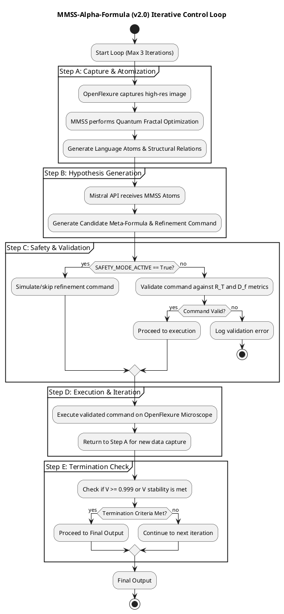

# MMSS-Alpha-Formula (v2.0) Iterative Control Loop UML Diagram

This document contains the PlantUML description of the iterative control loop for the MMSS-Alpha-Formula (v2.0) architecture.

```plantuml
@startuml
title MMSS-Alpha-Formula (v2.0) Iterative Control Loop

start

:Start Loop (Max 3 Iterations);

partition "Step A: Capture & Atomization" {
  :OpenFlexure captures high-res image;
  :MMSS performs Quantum Fractal Optimization;
  :Generate Language Atoms & Structural Relations;
}

partition "Step B: Hypothesis Generation" {
  :Mistral API receives MMSS Atoms;
  :Generate Candidate Meta-Formula & Refinement Command;
}

partition "Step C: Safety & Validation" {
  if (SAFETY_MODE_ACTIVE == True?) then (yes)
    :Simulate/skip refinement command;
  else (no)
    :Validate command against R_T and D_f metrics;
    if (Command Valid?) then (yes)
      :Proceed to execution;
    else (no)
      :Log validation error;
      stop
    endif
  endif
}

partition "Step D: Execution & Iteration" {
  :Execute validated command on OpenFlexure Microscope;
  :Return to Step A for new data capture;
}

partition "Step E: Termination Check" {
  :Check if V >= 0.999 or V stability is met;
  if (Termination Criteria Met?) then (yes)
    :Proceed to Final Output;
  else (no)
    :Continue to next iteration;
  endif
}

:Final Output;

stop

@enduml
```
